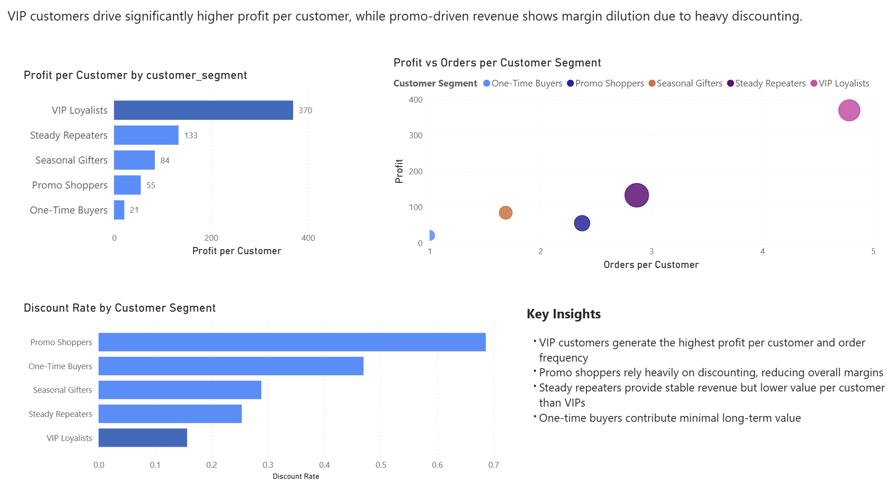
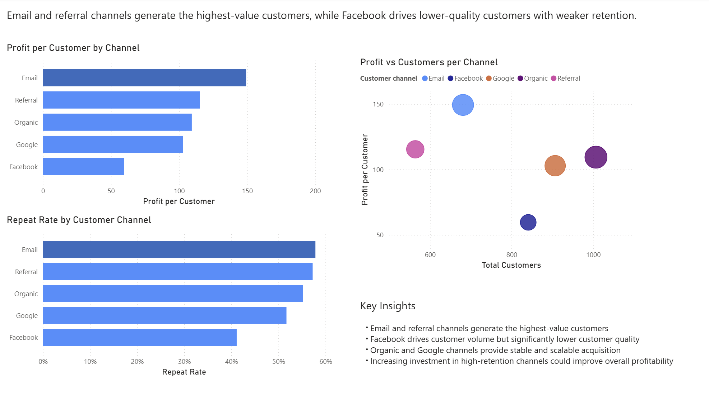

# Shopify Customer Revenue Dashboard

This project analyses e-commerce customer behaviour, acquisition performance, and revenue drivers to identify opportunities to improve profitability and retention.

The analysis focuses on customer segments, acquisition channels, repeat purchasing behaviour, and the impact of discounting on margins.

---

## Featured Dashboard

---

## Project Overview

In this project, I built a realistic e-commerce dataset and developed a Power BI dashboard to explore:

- Customer retention and repeat purchasing behaviour  
- Revenue distribution across customer segments  
- Acquisition channel performance and customer quality  
- The relationship between discounting and profitability  

The objective is to demonstrate how data analysis can be used to generate actionable business insights for an online retailer.

---

## Dataset

The dataset was synthetically generated to reflect realistic e-commerce behaviour and includes:

- 4,000 customers  
- 9,000+ orders  
- Multiple acquisition channels (Email, Organic, Google, Facebook, Referral)  
- Customer segments (VIP Loyalists, Steady Repeaters, Promo Shoppers, etc.)  
- Order-level revenue, cost, discount, and refund data  

The dataset was designed to include variation in:
- Profit margins  
- Customer value  
- Discount behaviour  
- Retention patterns  

---

## Tools Used

- Python (Pandas, NumPy) – data generation and validation  
- Power BI – dashboard design and visualisation  
- DAX – KPI and metric calculations  

---

## Key Insights

### Customer Behaviour

- 63% of total revenue is generated by returning customers, indicating a strong retention-driven business model  
- Customers place an average of 2.33 orders, demonstrating healthy repeat purchasing behaviour  
- The top 20% of customers generate approximately 56% of revenue, showing moderate concentration  

---

### Customer Segments

- VIP Loyalists are the most valuable segment, with the highest profit per customer and order frequency  
- Steady Repeaters generate the largest share of total revenue due to their scale  
- Promo Shoppers drive revenue but at lower margins due to heavy discounting  
- One-Time Buyers contribute minimal long-term value  

---

### Acquisition Channels

- Email and Referral channels generate the highest-value customers with strong retention  
- Facebook drives customer volume but significantly lower customer quality  
- Organic and Google provide stable and scalable acquisition  

---

### Profitability Drivers

- Heavy discounting reduces margins, particularly among promo-driven customers  
- High-value customers maintain strong profitability with lower reliance on discounts  
- Improving retention in lower-performing channels presents a clear opportunity for growth  

---

## Skills Demonstrated

- Customer segmentation and behavioural analysis  
- Revenue and profit decomposition  
- KPI development and business storytelling  
- Data modelling and DAX in Power BI  
- Building client-ready dashboards  

---

## Conclusion

This project demonstrates how customer behaviour, acquisition strategy, and pricing decisions interact to drive business performance.

The analysis highlights clear opportunities to:
- Prioritise high-value acquisition channels  
- Improve customer retention  
- Reduce reliance on discount-driven revenue  

---

## Files

- `shopify_customer_revenue_dashboard.pbix` – Power BI dashboard  
- `customers.xlsx` – customer dataset  
- `orders.xlsx` – order-level dataset  
- `Images/` – dashboard screenshots  

---
